# Architecture

## Overview

The repository is an npm monorepo:

- **`apps/api`** — NestJS HTTP service: chat completion with LLM failover, persistence, health, metrics, Swagger.
- **`apps/demo-ui`** — Next.js UI for manual testing and smoke automation.
- **`packages/contracts`** — Shared Zod schemas and TypeScript types for request/response payloads.

```mermaid
flowchart TB
  subgraph clients [Clients]
    Demo[Next_demo_UI]
    Ext[HTTP_clients]
  end
  subgraph api [NestJS_API]
    Chat[ChatModule]
    LLM[LlmService]
    Prisma[PrismaService]
    Prom[Prometheus_metrics]
  end
  subgraph aws [AWS_optional]
    EKS[EKS]
    RDS[(RDS_Postgres)]
    ALB[ALB_Ingress]
  end
  Demo --> Chat
  Ext --> Chat
  Chat --> LLM
  Chat --> Prisma
  Prisma --> PG[(Postgres)]
  Prom --> Scrape[Metrics_scraper]
  Chat --> EKS
  EKS --> ALB
  Prisma --> RDS
```

## API surface

| Method | Path | Purpose |
|--------|------|---------|
| POST | `/v1/chat` | Validate body, call LLM (mock / OpenRouter / Gemini failover), persist row |
| GET | `/v1/chats/:id` | Load persisted chat |
| GET | `/health/live` | Liveness |
| GET | `/health/ready` | Readiness (DB `SELECT 1`) |
| GET | `/metrics` | Prometheus text exposition |
| GET | `/docs` | Swagger UI |
| GET | `/docs-json` | OpenAPI JSON |

## LLM routing

1. If `LLM_MOCK=1`, return a deterministic mock string (no external calls).
2. Otherwise call **OpenRouter** (`OPENROUTER_API_KEY`, `OPENROUTER_MODEL`).
3. On failure (HTTP error, timeout, empty body), call **Gemini** (`GEMINI_API_KEY`, `GEMINI_MODEL`).
4. If both fail, respond with **503** (`ServiceUnavailableException`).

## AWS mapping (optional)

- **EKS** runs the API container from the root `Dockerfile`.
- **RDS PostgreSQL** supplies `DATABASE_URL` (TLS recommended; see [k8s/README.md](../k8s/README.md)).
- **ALB Ingress** exposes the service; manifests live under `k8s/base` and `k8s/overlays/aws-eks`.
