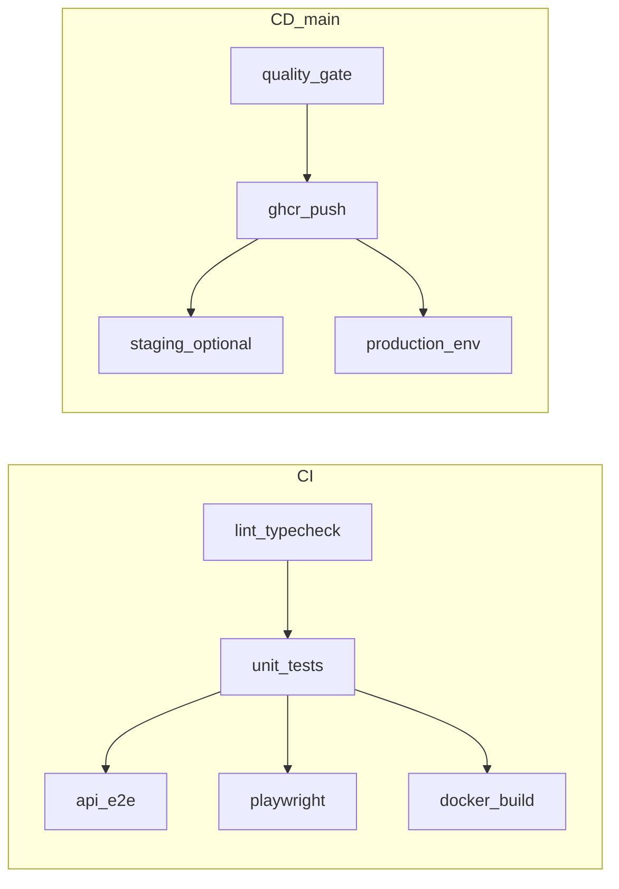

# CI/CD pipeline

## CI (`.github/workflows/ci.yml`)

Runs on every push and pull request:

1. **lint-typecheck** — ESLint (`lint:ci`) and TypeScript across workspaces.
2. **unit** — Contract + API unit tests with coverage (`test:cov`), coverage artifact upload, then production builds (contracts, API, demo UI).
3. **api-e2e** — Postgres service container, `prisma migrate deploy`, API e2e (Supertest) with `LLM_MOCK=1`.
4. **demo-playwright** — Same database setup, API in background, Playwright smoke against Next (`next start` in CI).
5. **docker-build** — Builds the root `Dockerfile` and scans the image with Trivy.

### SAST

Enable **CodeQL** under repository **Settings → Code security** to upload static analysis results (optional workflow can be added separately).

## CD (`.github/workflows/cd.yml`)

Runs on pushes to `main`:

1. **quality-gate** — `npm run ci` (same as local `make ci`).
2. **publish-image** — Builds and pushes `ghcr.io/<owner>/ai-chat-api:<git-sha>` and `:latest` using `GITHUB_TOKEN` (`packages: write`).
3. **deploy-staging / smoke-staging** — Placeholders; set repository variable `ENABLE_CD_STAGING=true` and wire real deploy steps.
4. **deploy-production / post-deploy-health** — Use GitHub Environment **`production`** for manual approval; set `ENABLE_CD_PRODUCTION=true` and implement rollout + rollback (`kubectl rollout undo`, redeploy previous digest, etc.).

### Variáveis e segredos (resumo)

| Item | Onde | Uso |
|------|------|------|
| `GITHUB_TOKEN` | Automático | Push da imagem para GHCR no job `publish-image` |
| `ENABLE_CD_STAGING` | Variável do repositório | Liga jobs de staging (padrão ausente / `false`) |
| `ENABLE_CD_PRODUCTION` | Variável do repositório | Liga deploy de produção |
| Ambiente `production` | GitHub Environments | Aprovação manual antes do deploy |

### PR previews (GHCR `pr-<n>`)

Para imagens de preview por PR (`ghcr.io/<owner>/ai-chat-api:pr-<n>`), adicione um job em `ci.yml` ou um workflow dedicado em `pull_request` com:

- `docker/login-action` no GHCR.
- `docker/build-push-action` com tag `pr-${{ github.event.number }}`.

Restrinja com `permissions: packages: write` e políticas do org.

### Vercel (demo UI)

Conecte o diretório `apps/demo-ui` a um projeto Vercel. Defina **`NEXT_PUBLIC_API_URL`** para o host da API (preview ou produção). O build Next incorpora essa variável em tempo de build.

### API "free tier" / hospedagem barata

Para ambientes de baixo custo, use um Postgres gerenciado gratuito ou compartilhado, defina `DATABASE_URL` no runtime, e execute `prisma migrate deploy` no bootstrapping (job de deploy ou init container), mantendo a mesma imagem Docker da raiz.

## CD AWS EKS (`.github/workflows/cd-aws-eks.yml`)

Disparo manual (`workflow_dispatch`) com input `image_tag`:

- Assume role via OIDC (`secrets.AWS_ROLE_ARN`).
- Build/push para ECR.
- `kubectl apply -k k8s/overlays/aws-eks` e `kubectl set image` + `kubectl rollout status`.

Variáveis de repositório sugeridas: `AWS_REGION`, `ECR_REPOSITORY`, `EKS_CLUSTER_NAME`.

Detalhes: [aws-eks-oidc.md](./aws-eks-oidc.md).

## Diagrama (visão geral)

